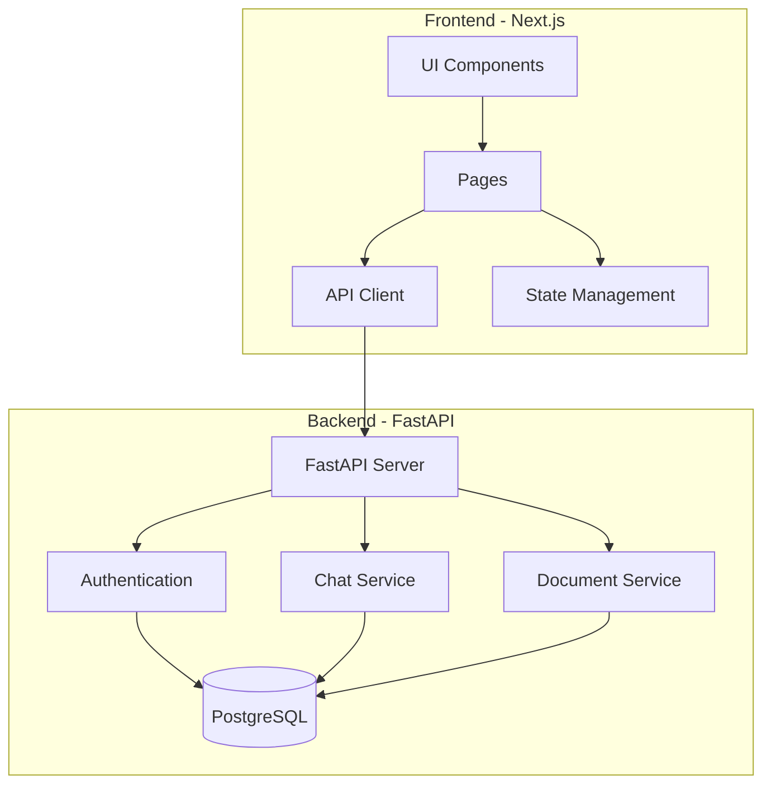

# Hermes - Document Processing and Search Platform

Hermes is a modern document processing and search platform built with Next.js and FastAPI, featuring real-time chat capabilities and advanced document management.

## Architecture



## Tech Stack

### Frontend
- Next.js 15.2
- React 19
- Shadcn UI Components
- TailwindCSS
- TypeScript
- Axios for API communication

### Backend
- FastAPI
- SQLAlchemy (Async)
- PostgreSQL
- Alembic for migrations
- Python 3.x

## Features

- 📱 Responsive Modern UI with Shadcn
- 💬 Real-time Chat Interface
- 📄 Document Processing and Management
- 🔍 Advanced Search Capabilities
- 🏢 Multi-organization Support
- 📊 Logging and Monitoring

## Getting Started

### Prerequisites
- Node.js (Latest LTS version)
- Python 3.x
- PostgreSQL
- Docker (optional)

### Installation

1. Clone the repository:
```bash
git clone https://github.com/yourusername/hermes.git
cd hermes
```

2. Set up the backend:
```bash
cd backend
python -m venv venv
source venv/bin/activate  # On Windows: .\venv\Scripts\activate
pip install -r requirements.txt
cp .env.example .env  # Configure your environment variables
```

3. Set up the frontend:
```bash
cd frontend
npm install
cp .env.example .env.local  # Configure your environment variables
```

### Running the Application

1. Start the backend server:
```bash
cd backend
uvicorn main:app --reload
```

2. Start the frontend development server:
```bash
cd frontend
npm run dev
```

The application will be available at:
- Frontend: http://localhost:3000
- Backend API: http://localhost:8000
- API Documentation: http://localhost:8000/docs

### Using Docker

You can also run the entire stack using Docker Compose:

```bash
docker-compose up
```

## Project Structure

```
hermes/
├── frontend/
│   ├── src/
│   │   ├── components/
│   │   ├── pages/
│   │   └── styles/
│   ├── public/
│   └── package.json
├── backend/
│   ├── controller/
│   ├── models/
│   ├── schemas/
│   ├── utils/
│   └── main.py
├── docker-compose.yml
└── README.md
```

## API Documentation

The API documentation is automatically generated and available at `/docs` when running the backend server. It includes detailed information about all available endpoints, request/response schemas, and authentication requirements.

## Contributing

1. Fork the repository
2. Create your feature branch (`git checkout -b feature/AmazingFeature`)
3. Commit your changes (`git commit -m 'Add some AmazingFeature'`)
4. Push to the branch (`git push origin feature/AmazingFeature`)
5. Open a Pull Request

## Next up
- User authentication and authorization support
- Support folder structure for cleaner document organization
- Support @ keyword search support in toolbar
